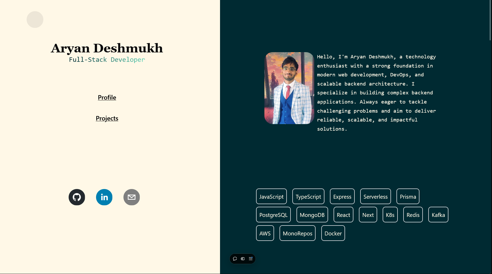

# 🌟 Portfolio Website

Welcome to my personal portfolio website! This site showcases my work, skills, and projects as a"Full-Stack Developer" . It's a testament to my passion for building innovative solutions and crafting engaging user experiences.

## 🚀 Features

- **About Me**: Learn more about my background, interests, and expertise.
- **Projects**: A collection of my most exciting and impactful projects, with descriptions and links to live demos or repositories.
- **Skills**: Highlights of the technologies and tools I specialize in.
- **Contact**: Easily get in touch via email, social links, or a built-in contact form.

## 🛠️ Tech Stack

The portfolio is built using the latest technologies to ensure optimal performance and a sleek user experience:

- **Frontend**: React, Vite, Tailwind CSS
- **Hosting**: Vercel
- **Other Tools**: Motion for animations, TypeScript for type safety

## 🖥️ Live Demo

Check out the live website here: [https://aryandeshmukh.vercel.app/](#)

## 📸 Preview

](#)  
*Screenshot of your homepage or a key feature.*

## 🛡️ License

This project is licensed under the [MIT License](LICENSE).

## 📬 Contact

Have any questions or want to collaborate? Reach out to me:

- **Email**: [adeshmukh843@gmail.com](mailto:adeshmukh843@gmail.com)
- **LinkedIn**: [Your LinkedIn](https://www.linkedin.com/in/aryandeshmukh-profile/')
- **GitHub**: [Your GitHub](https://github.com/AryanDesh)
